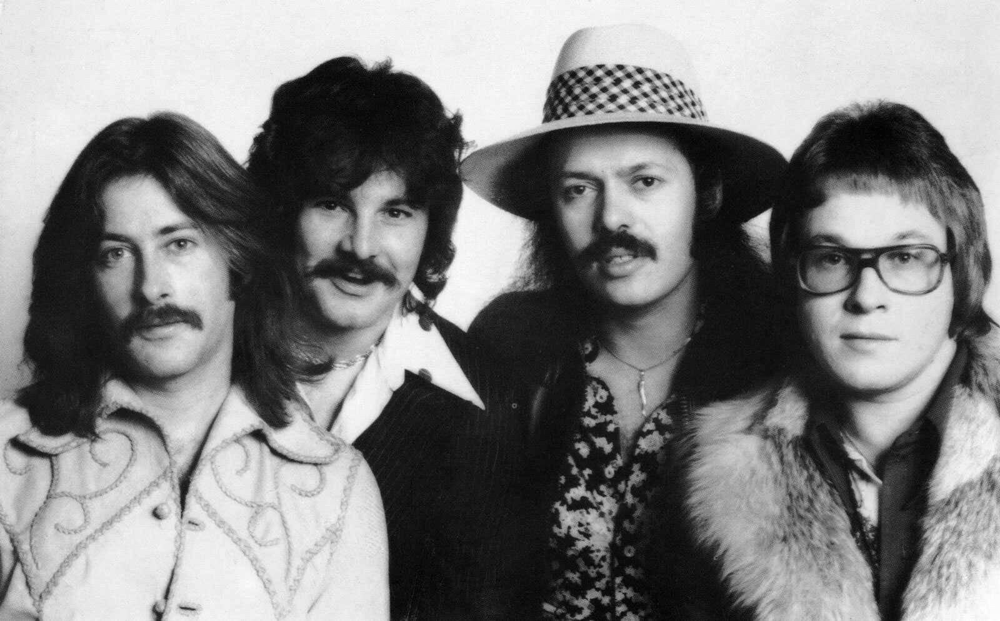

 
<h1>The Guess Who</h1>

   
The Guess Who es una banda de rock canadiense formada en Winnipeg, Manitoba en 1965. La banda ha tenido varios miembros a lo largo de su historia, pero su alineación más conocida y exitosa incluye al cantante Burton Cummings, al guitarrista Randy Bachman, al bajista Jim Kale, al baterista Garry Peterson y al tecladista Bob Ashley.

## Historia

The Guess Who se formó en 1965 como un grupo de garage rock en Winnipeg, Manitoba. Originalmente compuesta por el guitarrista Randy Bachman, el bajista Jim Kale, el baterista Garry Peterson y el tecladista Bob Ashley, la banda tocó en clubes locales durante varios años antes de lanzar su primer álbum en 1965.

En 1968, Burton Cummings se unió a la banda como vocalista principal y tecladista, lo que llevó a un cambio en el sonido y el estilo de la banda. En los años siguientes, The Guess Who lanzó una serie de éxitos, incluyendo "American Woman", "No Sugar Tonight", "Laughing" y "Undun".

Aunque la banda ha pasado por varias alineaciones desde su formación, su legado y su impacto en la música rock canadiense y mundial han sido significativos.

## Discografía seleccionada

- *Wheatfield Soul* (1969)
- *American Woman* (1970)
- *Share the Land* (1970)
- *So Long, Bannatyne* (1971)
- *Rockin'* (1972)
- *#10* (1973)

## Miembros destacados

- Burton Cummings - voz principal, teclados (1968-1975)
- Randy Bachman - guitarra, voz (1965-1970)
- Jim Kale - bajo (1965-1978)
- Garry Peterson - batería (1965-presente)

## Enlaces externos

- [Sitio web oficial de The Guess Who](https://www.theguesswho.com/)
- [Página de Wikipedia de The Guess Who](https://en.wikipedia.org/wiki/The_Guess_Who)
- [The Guess Who en AllMusic](https://www.allmusic.com/artist/the-guess-who-mn0000065646)
